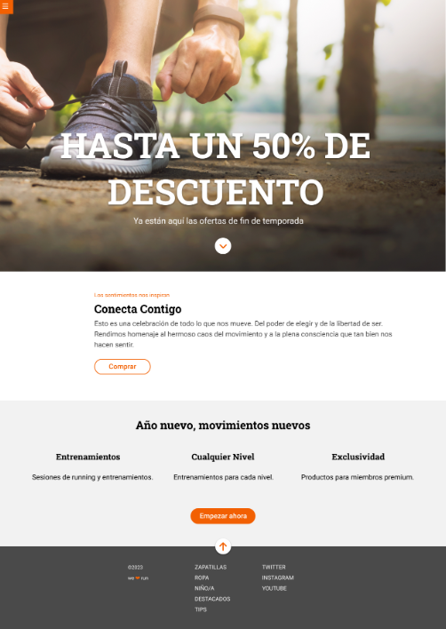

#modulo-1-evaluacion-final-Naidev7
¡Bienvenido/a al repositorio de la Landing Estática! Este proyecto tiene como objetivo principal aplicar y demostrar el uso efectivo de tecnologías como Flexbox, SCSS, Grid y Media Queries para crear una página web atractiva y totalmente receptiva. 

La landing ha sido desarrollada mobile first. Además, he incorporado animaciones en los botones para mejorar la experiencia del usuario y profundizar en dichos aspectos.

#Hitos del Proyecto
1.Flexbox:
Se ha utilizado Flexbox para lograr un diseño flexible y eficiente..
SCSS:

2.SCSS ha sido utilizado para organizar y modular el código CSS de manera más clara y eficiente, facilitando el mantenimiento y la escalabilidad del proyecto.

3.Grid:
 Ha sido emplada para estructurar y alinear los elementos de la página de manera ordenada y estéticamente agradable.
Media Queries:

4.Media Queries:
 para garantizar que la landing sea totalmente receptiva en una variedad de dispositivos y tamaños de pantalla, proporcionando una experiencia consistente y agradable.

#Implementación
1.Clonar el Repositorio:

2.No se requieren dependencias externas. Solo necesitas un navegador web moderno.
Estructura del Proyecto:

3.El código fuente se encuentra en el directorio src, donde encontrarás archivos HTML, SCSS y cualquier archivo JavaScript si es necesario.
Compilar SCSS:

4.Si realizas cambios en los archivos SCSS, asegúrate de compilarlos en CSS. Puedes utilizar herramientas como Sass o tu propio compilador de SCSS.
Prueba Local:

5.Abre el archivo HTML en tu navegador local para asegurarte de que el diseño y las animaciones se vean como se esperaba.
